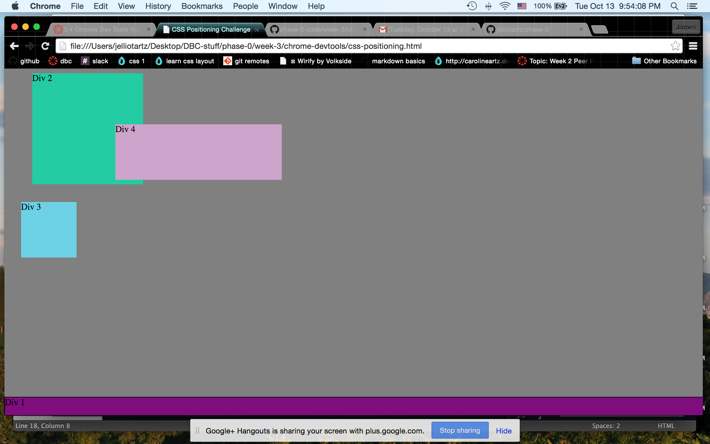
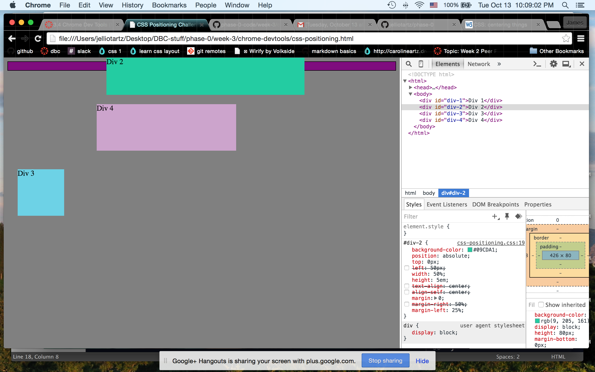
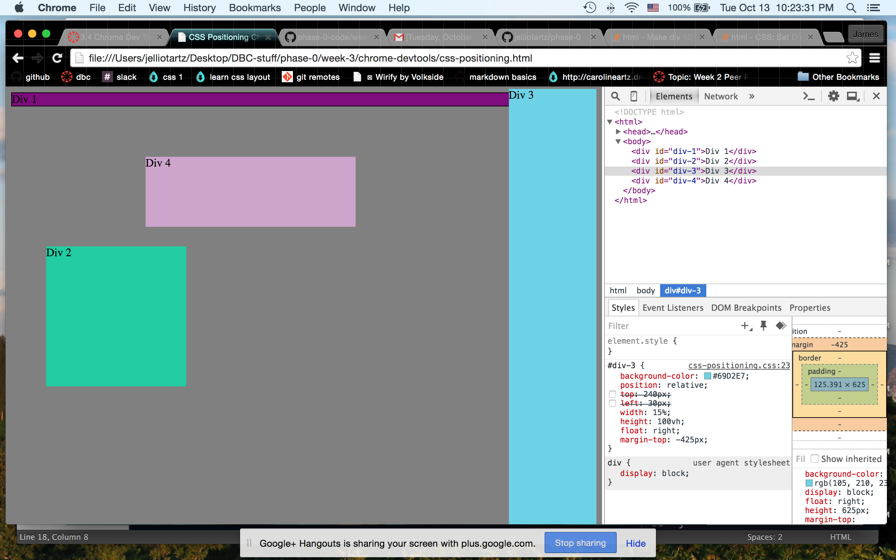
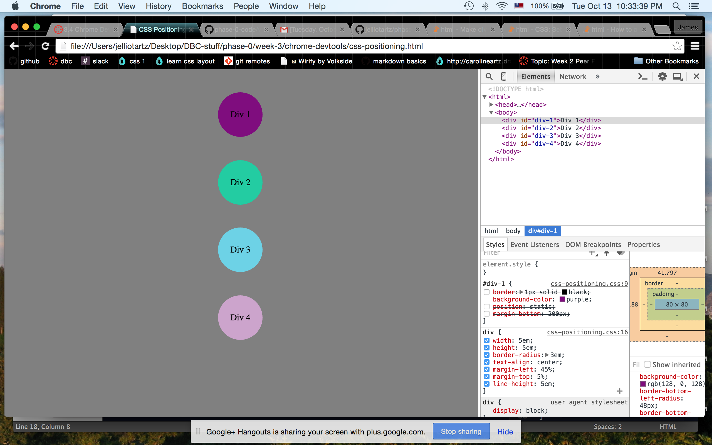

#### How can you use Chrome's DevTools inspector to help you format or position elements?

Chrome's DevTools inspector allows you to adjust CSS elements in the browser and see what effect the changes have immediately, rather than needing to save the .css file and refresh the browser. It's a much quicker process that allows you to tweak things much more efficiently.

#### How can you resize elements on the DOM using CSS?

By adjusting the selector values you can view the effects of your adjustments on the DOM.

#### What are the differences between Absolute, Fixed, Static, and Relative positioning? Which did you find easiest to use? Which was most difficult?

Summarizing [cssbasics](http://www.cssbasics.com/css-positioning/)'s definitions:
* Static is basically the same as declaring no position
* Relative position places the element within the normal flow of your html, and then offsets it using properties such as left, right, top, and bottom.
* Absolute position removes the element from the normal flow of your html, and positions it in relation to a parent element.
* Fixed position also removes the element from the normal flow of your html, but the parent element is always the browser window.

#### What are the differences between Margin, Border, and Padding?

Margin declares the distance between an HTML element and the elements around it.

Border declares how the outer limits of an HTML element will be defined.

Padding is the distance between the border of an HTML element and the content within it.

#### What was your impression of this challenge overall? (love, hate, and why?)

I thought this challenge was very useful. Although I had been using Chrome DevTools to inspect html and css of various websites for a few days, I was not aware of the ability to tweak and play with the values until I did this exercise. I'll defintely use this tool more in the future, and this exercise was a good chance to practice.

#### Below are my inline screenshots:

