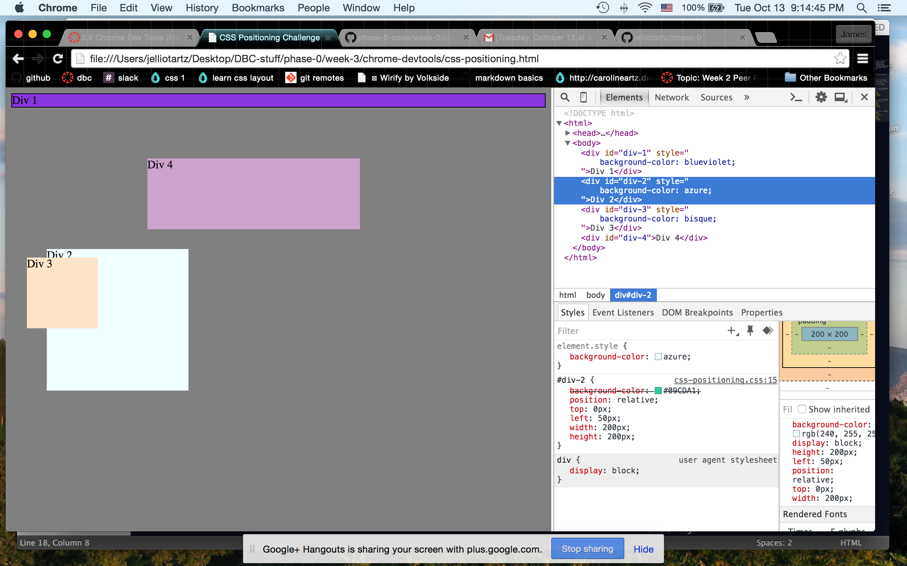
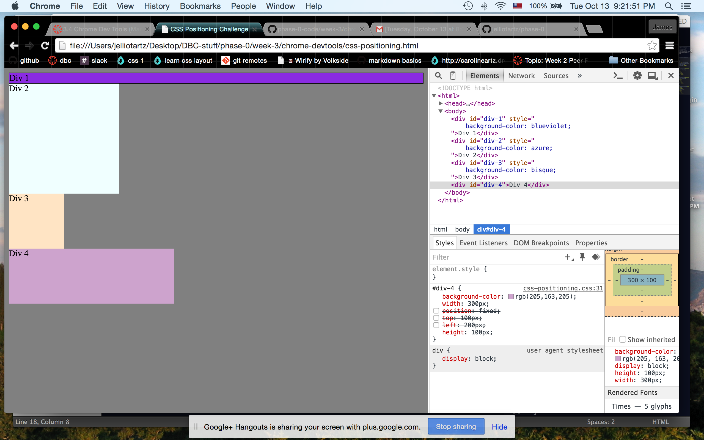
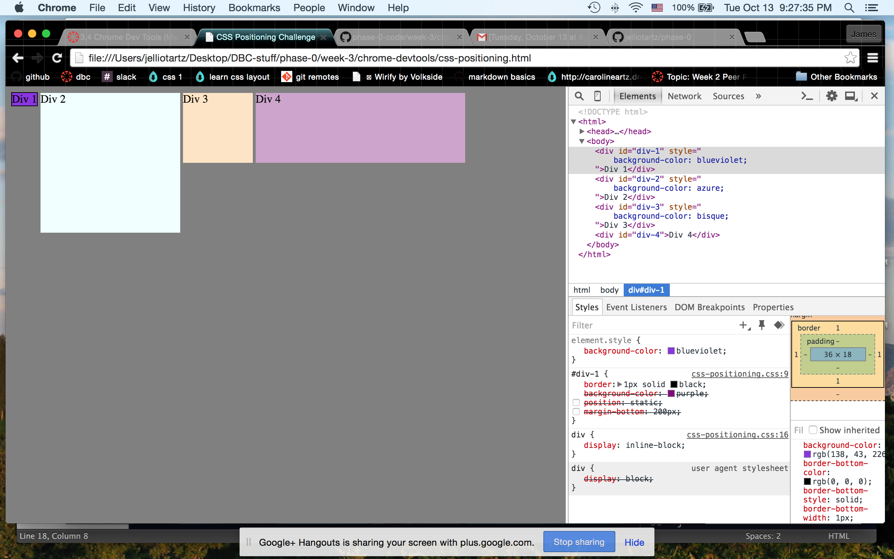
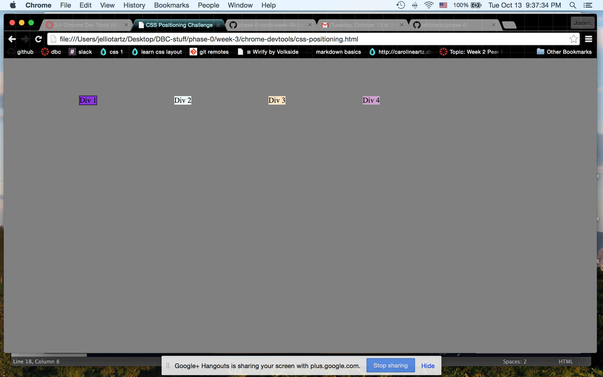
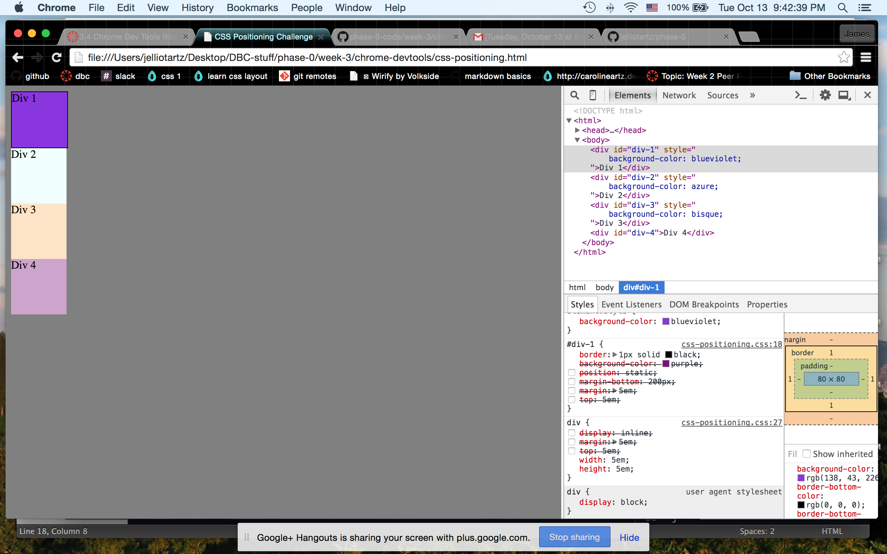

How can you use Chrome's DevTools inspector to help you format or position elements?

How can you resize elements on the DOM using CSS?

What are the differences between Absolute, Fixed, Static, and Relative positioning? Which did you find easiest to use? Which was most difficult?

What are the differences between Margin, Border, and Padding?

What was your impression of this challenge overall? (love, hate, and why?)

Below are my inline screenshots:

